更新时间：2025年06月16日11:04:53


# 文件结构
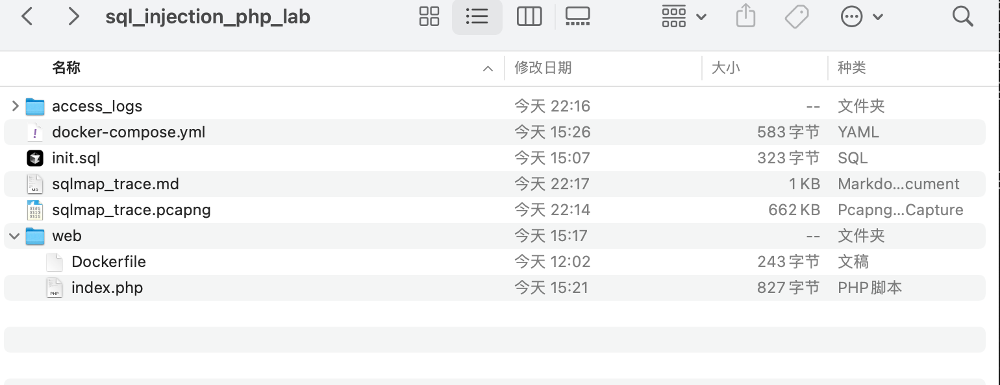

# 环境准备
分析机：kali linux  192.168.13.145 

靶机：docker环境 192.168.13.1

攻击工具：sqlmap（[https://sqlmap.org/](https://sqlmap.org/)）

分析工具：网站访问日志access.log、kali的wireshark


# 启动方法
```python
docker-compose up -d --build
```


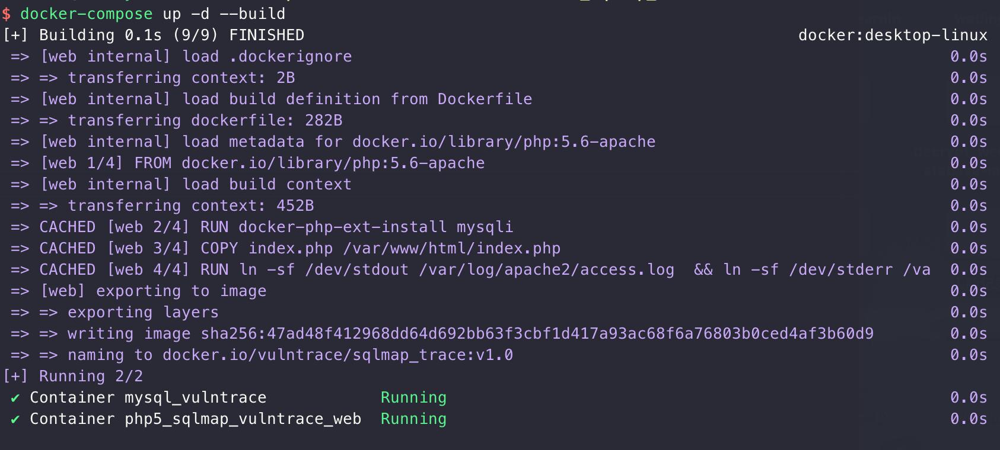


然后访问http://目标ip:8080端口


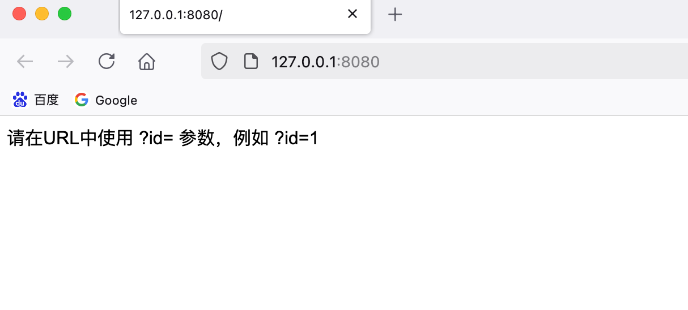

此时在access_logs目录下存在access.log文件，并有访问日志：


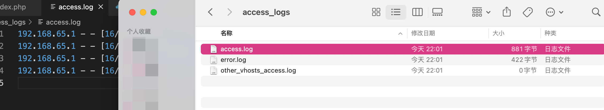

# sqlmap特征识别
在这里输入单引号，发现存在报错：


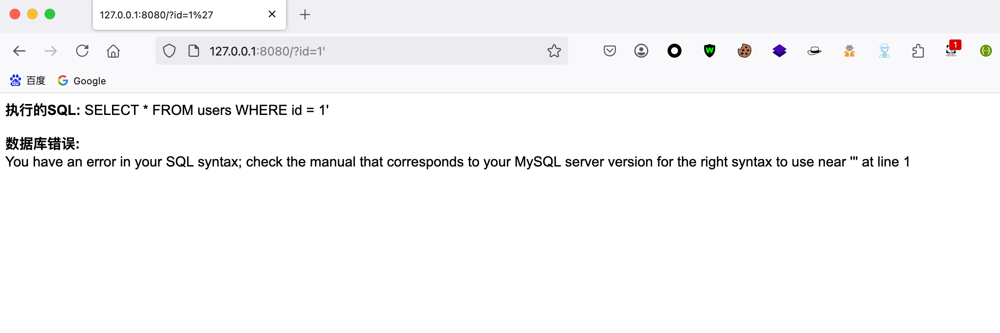


此时使用wireshark抓包，并且使用sqlmap跑一下包看下：


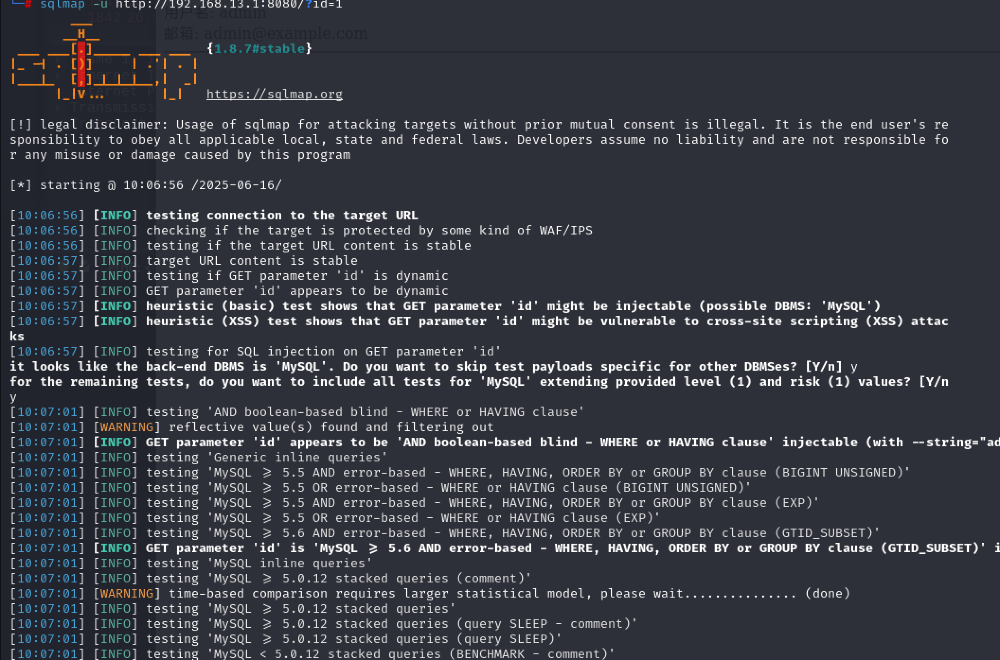


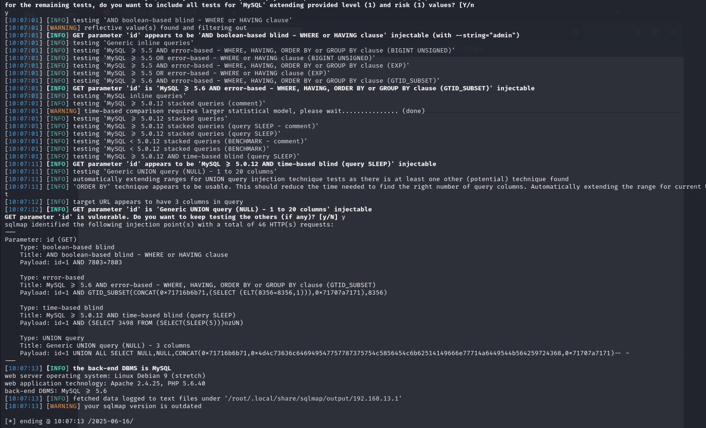


此时存在sql注入漏洞，并且发现存在几种注入方法。

# 特征分析
## access.log日志
在sqlmap注入之后，在access.log日志文件里面可以找到sqlmap的关键特征信息：


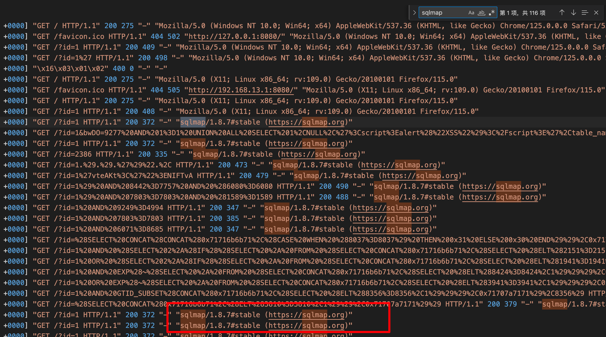


此时可以看到当前存在的sqlmap的版本号和特征信息。

## 流量分析
分析wireshark抓包流量，过滤http请求：


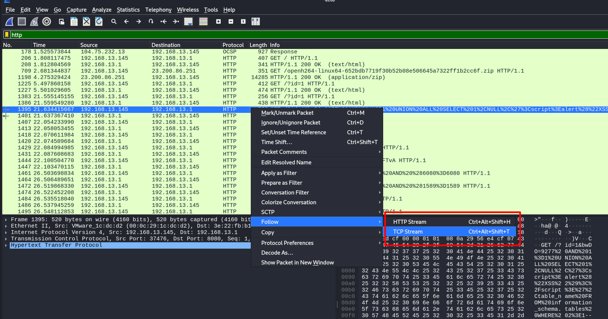


追踪一下tcp流看下：

此时在User-Agent里面可以看到sqlmap的特征信息：

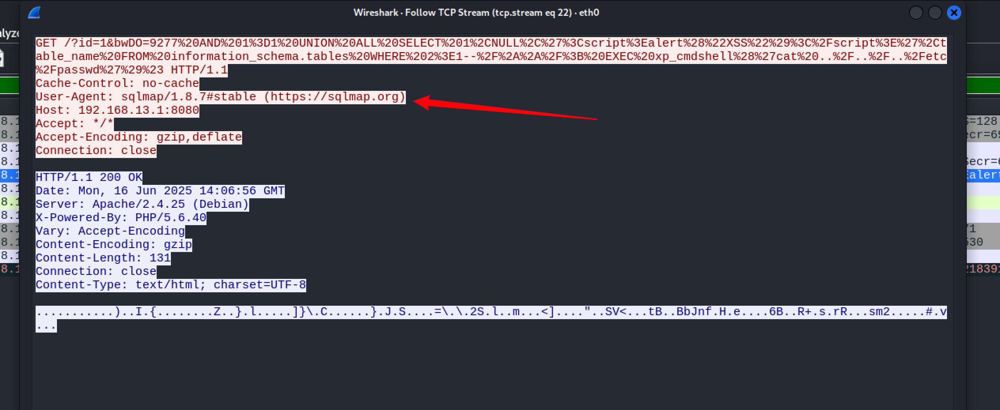


# 实验结束
分析完成之后，使用：

```python
docker-compose down
```


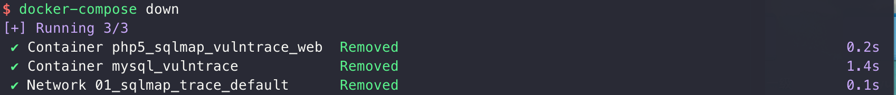


